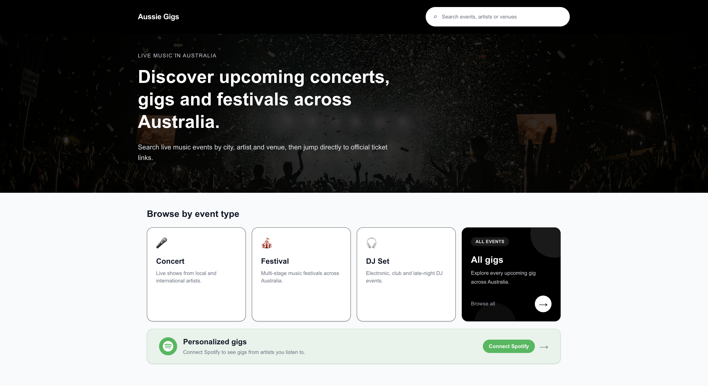

# Aussie Gigs

A full-stack web app for browsing Australian music gigs, artists, and venues.

Production site:

```text
https://aussie-gigs.simonpan.dev
```



## Tech Stack

- Frontend: Next.js, React, TypeScript, Tailwind CSS
- Backend: FastAPI, SQLAlchemy, Alembic
- Database: PostgreSQL
- Containerization: Docker, Docker Compose
- Production hosting: AWS ECS Fargate, Amazon ECR, Application Load Balancer, Route 53, ACM

## Project Structure

```text
frontend/          Next.js app
backend/           FastAPI app
backend/alembic/   Database migrations
docker-compose.yml Local Docker setup
```

## Run With Docker

Start the full app, including PostgreSQL:

```bash
docker compose up --build
```

Then open:

```text
http://localhost:3000
```

API health check:

```text
http://localhost:8000
```

## CI/CD

GitHub Actions runs CI on pushes and pull requests. Production deploys run from
`.github/workflows/cd.yml`:

```text
main -> Docker build -> ECR push -> ECS Fargate deploy
```

Required Actions variables:

```text
AWS_ACCOUNT_ID, AWS_REGION, AWS_ROLE_TO_ASSUME
ECR_BACKEND_REPOSITORY, ECR_FRONTEND_REPOSITORY
ECS_CLUSTER, ECS_BACKEND_SERVICE, ECS_FRONTEND_SERVICE
NEXT_PUBLIC_API_BASE_URL
ALB_HTTPS_LISTENER_ARN, FRONTEND_ECS_HOST, FRONTEND_CUSTOM_DOMAIN_RULE_ARN
```

Deploy auth uses GitHub OIDC. The frontend deploy also syncs the custom-domain
ALB listener rule so `aussie-gigs.simonpan.dev` follows the active ECS target
group after each redeploy.

## Local Development

Frontend:

```bash
cd frontend
npm install
npm run dev
```

Backend:

```bash
cd backend
pip install -r requirements.txt
uvicorn app.main:app --reload
```

For local backend development, set `DATABASE_URL` to your PostgreSQL database.

## Database

Docker Compose runs PostgreSQL and automatically starts the backend after applying migrations:

```bash
alembic upgrade head
```

Event, artist, venue, and ticket data can be imported from Ticketmaster:

```bash
curl -X POST "http://localhost:8000/integrations/ticketmaster/sync-catalog?state_code=VIC&size=100"
```

Upcoming Ticketmaster events can also be synced manually:

```bash
curl -X POST "http://localhost:8000/integrations/ticketmaster/sync-upcoming?state_code=VIC&size=100"
```

Docker Compose also starts a `ticketmaster-sync` worker. It runs the upcoming
Ticketmaster sync for every Australian state and territory every 24 hours. Each
run writes a log row that can be checked with:

```bash
curl "http://localhost:8000/integrations/sync-logs?source=ticketmaster"
```

In production, `.github/workflows/scheduled-imports.yml` runs scheduled import
jobs once per day through GitHub Actions. It currently syncs Ticketmaster
upcoming events and expects these repository secrets:

```text
DATABASE_URL
TICKETMASTER_API_KEY
```

Optional repository variables:

```text
TICKETMASTER_SYNC_STATES=ACT,NSW,NT,QLD,SA,TAS,VIC,WA
TICKETMASTER_SYNC_PAGE_SIZE=100
```
